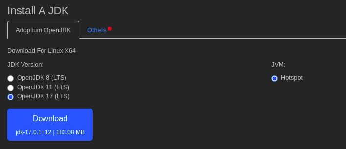

# **Installer Java**

L'environnement de développement interactif (IDE) que je recommande est VSCode, il est très simple d'utilisation et s'adapte à énormément de langages informatiques.

Je vous invite donc à télécharger et installer [VSCode](https://code.visualstudio.com/).


Il faut ensuite installer l'extension recommandée pour Java [Extension Pack for Java](https://marketplace.visualstudio.com/items?itemName=vscjava.vscode-java-pack), soit en cherchant son nom dans la liste des extensions, soit en tapant la commande dans l'ouverture rapide de VSCode (Ctrl+P).
```
ext install vscjava.vscode-java-pack
```


Ensuite, une fenêtre devrait s'ouvrir, vous indiquant que pour que l'extension fonctionne, il est nécessaire d'installer le kit de développement java (JDK). Si la fenêtre ne s'ouvre pas, il vous suffit d'aller sur le site d'[oracle](http://jdk.java.net/) pour le télécharger.


<br><br>

**Linux**

Inutile de télécharger le fichier, il faut ouvrir un terminal et taper les deux commandes suivantes.
```
sudo apt install openjdk-17-jre-headless
sudo apt install openjdk-17-jdk-headless
```
<br>

**Windows**

Le fichier téléchargé est un exécutable, il suffit de le lancer pour l'installer.
<br><br>


**Mac**

Le fichier téléchargé est un exécutable, il faut le lancer pour l'installer, ensuite, il est nécessaire de définir la variable d'environnement en tapant la commande suivante dans le terminal.

```
export JAVA_HOME=`/usr/libexec/java_home`
```
N'ayant pas de Mac, je n'ai pas pu tester, si ça ne fonctionne pas, il existe beaucoup de tutoriels sur internet, [celui-ci](https://www.youtube.com/watch?v=hts1lGSKZfc) par exemple.
<br><br>

Normalement, vous devriez maintenant pouvoir exécuter un fichier java, je vous invite donc à redémarrer VSCode et ouvrir le programme HelloWorld.java pour le lancer.

