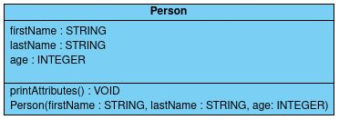

# **Classe en Java**

## Créer une classe

Reprenons la classe précédente et ne nous occupons pas des portées pour l'instant :



Par convention, le nom de la classe commence toujours par une majuscule et est également le nom du fichier (on met donc une classe par fichier). Voici alors la définition de notre classe en Java :
```java
class Person {
    // Déclaration des attributs
    String firstName;
    String lastName;
    int age;

    // Définitions des méthodes
    void printAttributes() {
		System.out.println(firstName + " " + lastName + " " + age + " years old");
	}

    // Définitions des constructeurs
    Person(String firstName, String lastName, int age) {
        firstName = firstName; // ambiguïté
        lastName = lastName; // ambiguïté
        age = age; // ambiguïté
    }
}
```
<br>


## Éviter les ambiguïtés

On remarque que dans le constructeur, il y a une ambiguïté, les paramètres ont les mêmes noms que les attributs. Heureusement, il suffit de préfixer nos attributs avec *this* pour régler le problème :

```java
Person(String firstName, String lastName, int age) {
    this.firstName = firstName; // this.firstName est l'attribut
    this.lastName = lastName; // this.lastName est l'attribut
    this.age = age; // this.age est l'attribut
}
```

Dans la définition de la classe, il est donc très important de préfixer chaque attribut de *this*, même lorsqu'il n'y a pas d'ambiguïté, ainsi, on rend le programme plus lisible.
```java
void printAttributes() {
    System.out.println(this.firstName + " " + this.lastName + " " + this.age + " years old");
}
```

À noter que *this* peut également être utilisé devant une méthode, à la fin de notre constructeur, on pourrait très bien appeler la méthode printAttributes par exemple :
```java
Person(String firstName, String lastName, int age) {
    this.firstName = firstName;
    this.lastName = lastName;
    this.age = age;
    this.printAttributes(); // appel la méthode printAttributes
}
```

Attention, le fichier *Person.java* n'est pas exécutable, il définit simplement la classe *Person* !