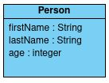
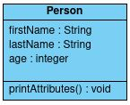
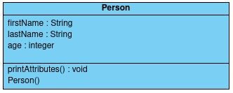
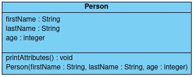
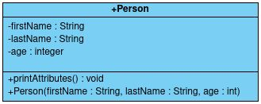

# **Programmation orientée objet**

## **C'est quoi ?**

L'objectif de la programmation orientée objet est d'avoir des programmes plus structurés et d'éviter certaines répétitions.

L'idée est de créer des types personnalisés, par exemple, si je veux stocker plusieurs informations sur une personne, plutôt que de créer plusieurs variables pour les stocker, je vais directement créer un type Personne, il ne me restera alors qu'à créer une variable de ce type pour stocker tout ce dont j'ai besoin.

Ce genre de type personnalisé s'appelle une classe et permet de contenir plusieurs variables et même plusieurs fonctions de tout type.
<br><br>


## **Classe**

Lorsqu'on défini une classe, on peut définir ses attributs, ce sont les variables qu'elle contient, pour chacun, il faut définir un nom et un type.

Par exemple, voici la classe Personne qui possède 3 attributs : nom (chaîne de caractères), prénom (chaîne de caractères) et âge (entier) :



Lors de la définition d'une classe, on peut définir ses méthodes, ce sont les fonctions qu'elle contient, pour chacune, il faut définir un type de valeur de retour, un nom et des paramètres.

Par exemple, on peut ajouter une méthode à la classe précédente, celle-ci pourrait notamment servir à afficher chacun de ses attributs.




Il ne faut pas oublier une chose, une classe n'est qu'un type, une variable doit donc l'instancier, on appellera alors cette variable, un objet.
<br><br>


## **Objet**

Dans l'idée, l'objet n'est qu'une variable ayant pour type une classe, dans la plupart des langages, la déclaration ressemble donc à ça :
```java
Person person;
```

Cependant, l'initialisation est différente, elle doit se faire à l'aide d'un constructeur de la classe.

Un constructeur est une méthode dont on ne précise pas la valeur de retour, elle permet d'initialiser l'objet. Dans le cas précédent, le constructeur le plus simple ne prendrait pas de paramètre et se contenterait de créer l'objet.



D'où l'initialisation :
```java
person = new Person(); // new pas toujours nécessaire (dépend du langage)
```

Ensuite, si on veut initialiser ou modifier les attributs de notre objet, voici ce à quoi ça ressemble dans la plupart des langages :
```java
person.firstName = "Thomas";
person.lastName = "PDM";
person.age = 21;
```


Cependant, pour l'initialisation, on peut être plus efficace et créer un constructeur qui initialise les attributs avec les arguments passés en paramètres.



D'où l'initialisation :
```java
person = new Person("Thomas", "PDM", 21);
```

Enfin, dans la plupart des langages, une méthode d'un objet s'appelle comme une fonction sauf qu'on la préfixe du nom de l'objet :
```java
person.printAttributes(); // Exécute la méthode printAttributes
```
<br>


## **Portée**

Dans la plupart des langages, on peut configurer la portée d'une classe, de ses attributs et de ses méthodes, c'est-à-dire, depuis où on peut y faire appel.

| portée  | signification                                                | 
| :------ |:------------------------------------------------------------ |
| public  | peut être appelé depuis n'importe où                         |
| package | peut être appelé depuis le fichier et les fichiers adjacents |
| private | peut être appelé depuis le fichier                           | 
<br>

Généralement, la portée s'indique avant le type :
```java
public class Person {
    public String firstName; // public
    String lastName; // package (souvent le cas quand aucun mot clé)
    private int age; // private
}
```

Ainsi, depuis un autre fichier, il sera impossible de modifier l'âge :
```java
person.age = 22; // impossible sauf dans le fichier de la classe Person
```
<br>

## **UML**

Il s'agit simplement d'une norme pour représenter des classes, par exemple, la classe Person ressemble à ça :


Il est également possible de préciser la portée de chaque élément à l'aide de symbole.

| portée  | symbole | 
| :------ |:------- |
| public  | +       |
| package | ~       |
| private | -       | 

À savoir que, par convention, généralement, la classe et ses méthodes ont une portée publique tandis que ses attributs ont une portée privée.


<br><br>


## Pour aller plus loin

Il existe évidemment beaucoup d'autres concepts de la programmation orientée objet, cependant, je pense qu'il faut déjà se concentrer sur les bases que je viens d'expliquer.

Si vous voulez aller plus loin, je vous invite à consulter certains cours en ligne.