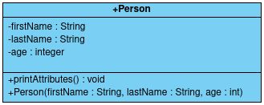

# **Définir la portée en Java**

Pour ce qui est de la portée, telle que nous l'avons fait, elle est dans le package (répertoire du fichier *Person.java*), c'est la portée mise par défaut quand on ne précise rien. Essayons maintenant de modifier la portée en suivant la convention mentionnée plus tôt :



```java
public class Person {
    private String firstName;
    private String lastName;
    private int age;

    public void printAttributes() {
		System.out.println(this.firstName + " " + this.lastName + " " + this.age + " years old");
	}

    public Person(String firstName, String lastName, int age) {
        this.firstName = firstName; // ambiguïté
        this.lastName = lastName; // ambiguïté
        this.age = age; // ambiguïté
    }
}
```

Si vous avez compris la portée, vous devez vous dire qu'on risque d'avoir un problème pour modifier les attributs et vous avez raison ! Pour remédier à ça, nous allons simplement créer des méthodes qui servent à modifier nos attributs :

```java
public void setFirstName(String firstName) {
    this.firstName = firstName;
}
public void setLastName(String lastName) {
    this.lastName = lastName;
}
public void setAge(int age) {
    this.age = age;
}
```

Et pour récupérer les valeurs des attributs, il suffit également de créer des méthodes :

```java
public String getFirstName() {
    return this.firstName;
}
public String getLastName() {
    return this.lastName;
}
public int getAge() {
    return this.age;
}
```